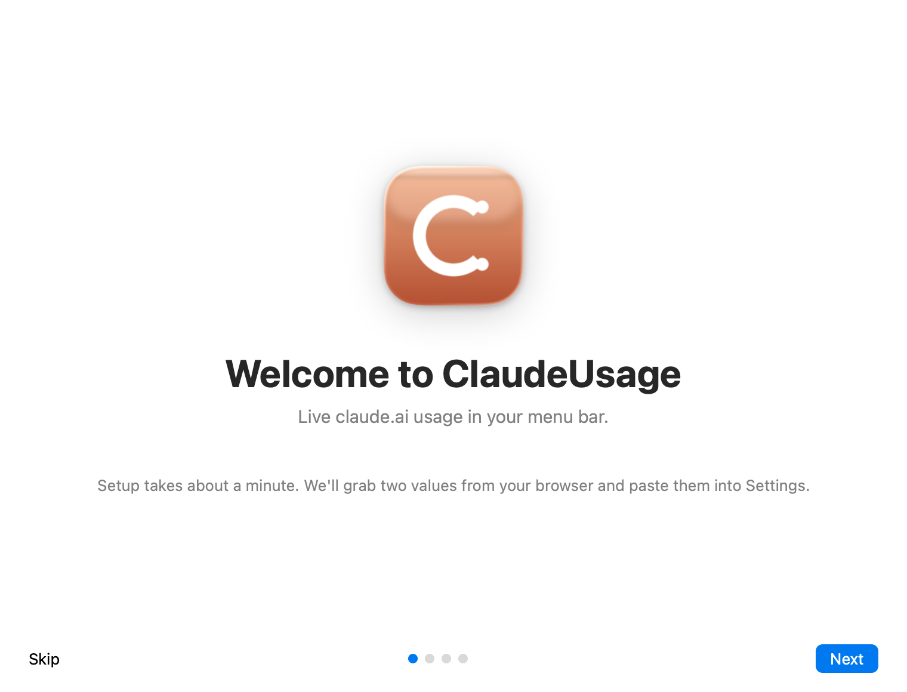
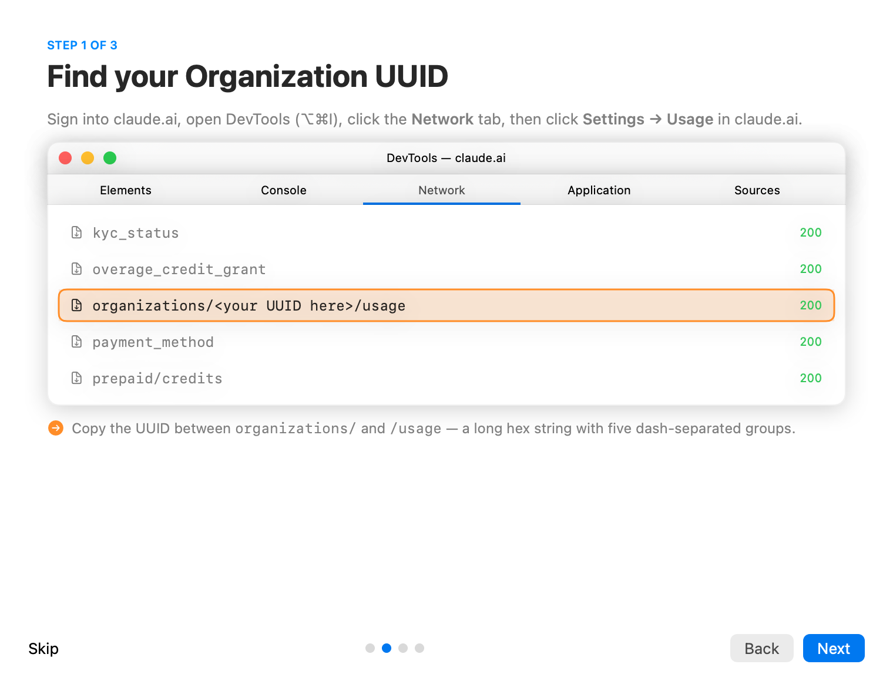
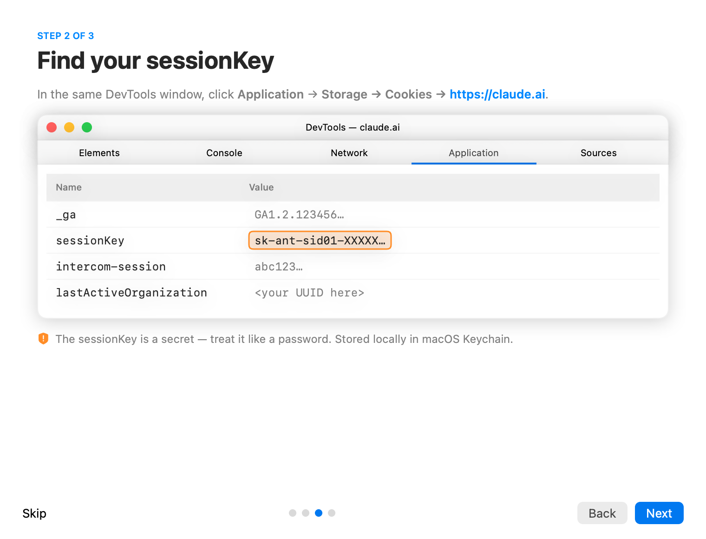
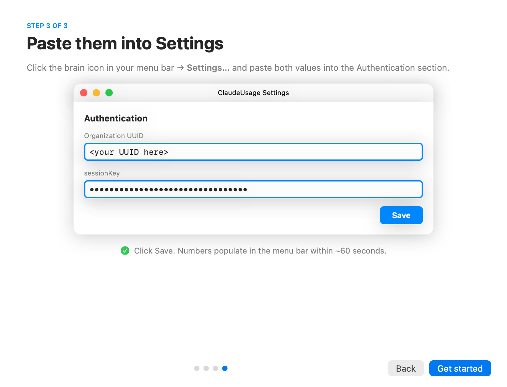

# ClaudeUsage


**Easy install with guide.** A macOS menu bar app that shows real-time [claude.ai](https://claude.ai) usage — the rolling 5-hour session window, the 7-day weekly window, and the Opus weekly window (if your plan has one).

- Color-coded percentage right in the menu bar (blue under 70%, orange 70–90%, red above 90%)
- Notifications at 80% and 95% per window (with hysteresis so they don't spam)
- Optional Launch at Login
- `sessionKey` stored in the macOS Keychain — never on disk
- Polls every 60s, click the refresh button to force-update
- **Built-in first-run welcome tour** that walks you through setup in under a minute

The app talks to the same internal endpoint that `claude.ai/settings/usage` calls. **It's not a public Anthropic API** — it can change at any time without notice.

---

## The first-launch tour

When you open the app for the first time, a 3-step welcome window walks you through exactly what to copy from your browser. You can re-open it anytime from Settings → Help → "Show welcome tour".

<table>
  <tr>
    <td align="center" width="50%"><b>Welcome</b><br></td>
    <td align="center" width="50%"><b>Step 1 — Organization UUID</b><br></td>
  </tr>
  <tr>
    <td align="center" width="50%"><b>Step 2 — sessionKey</b><br></td>
    <td align="center" width="50%"><b>Step 3 — Paste into Settings</b><br></td>
  </tr>
</table>

---

## Download & run (no Xcode needed)

1. Grab the latest `ClaudeUsage.zip` from [Releases](https://github.com/Aiduckman/ClaudeUsage_latest_may2026/releases/latest).
2. Unzip → drag `ClaudeUsage.app` into `/Applications`.
3. **Quarantine bypass** — because the app isn't signed with a paid Apple Developer ID, macOS will refuse to open it on first run. Two options:
   - **Easiest**: in Terminal, run `xattr -dr com.apple.quarantine /Applications/ClaudeUsage.app` then open it normally.
   - **Or**: right-click the app → **Open** → click **Open** in the dialog (one-time permission).
4. Launch. The welcome tour pops up — follow it.

That's the whole setup. Numbers populate in the menu bar within ~60s of saving your credentials.

---

## How to find your Organization UUID & sessionKey (text version)

If you prefer text instructions to the in-app tour:

Sign into <https://claude.ai>. Open DevTools (`⌥⌘I`).

**Organization UUID** — visible to your account, stable, not secret:
1. **Network** tab → filter Fetch/XHR.
2. Click **Settings → Usage** in claude.ai.
3. Find a request to `https://claude.ai/api/organizations/<UUID>/usage`.
4. Copy `<UUID>`.

**sessionKey** — treat like a password:
1. **Application** tab → **Storage → Cookies → https://claude.ai**.
2. Copy the **Value** of the `sessionKey` row (a long string starting with `sk-ant-sid01-...`).
3. The sessionKey eventually expires — if the app says "Not signed in", grab a fresh one and paste again.

---

## Build from source

Requirements: macOS 14 (Sonoma) or later, full [Xcode](https://apps.apple.com/app/xcode/id497799835), [Homebrew](https://brew.sh), and [XcodeGen](https://github.com/yonaskolb/XcodeGen) (`brew install xcodegen`).

```bash
git clone https://github.com/Aiduckman/ClaudeUsage_latest_may2026.git
cd ClaudeUsage_latest_may2026
chmod +x build.sh
./build.sh
mv ClaudeUsage.app /Applications/
open /Applications/ClaudeUsage.app
```

Then configure via Settings (or wait for the welcome tour on first launch).

---

## Customize

- **Bundle ID**: change `PRODUCT_BUNDLE_IDENTIFIER` in `project.yml` *and* the matching `service` in `SessionStore.swift`. Defaults are `com.example.claudeusage`.
- **Polling interval**: edit `pollingInterval` in `UsageViewModel.swift` (default: 60s).
- **Notification thresholds**: edit `thresholds: [Int]` in `UsageViewModel.swift` (default: `[80, 95]`).
- **Icon**: edit `make_icon.py` (Python + Pillow) and rebuild via the snippet in the [build script](build.sh).
- **Re-render the tour screenshots**: run `ClaudeUsage.app/Contents/MacOS/ClaudeUsage --capture-onboarding=docs/onboarding/`. This uses SwiftUI's `ImageRenderer` to render each page directly to PNG — no system permissions required.

## Project layout

```
ClaudeUsage/
├── project.yml                # XcodeGen project definition
├── build.sh                   # one-shot build script
├── make_icon.py               # icon generator (Python + Pillow)
├── AppIcon.icns               # bundled app icon
├── scripts/check-leaks.sh     # pre-commit personal-data scanner
├── docs/
│   ├── icon.png               # icon preview for README
│   └── onboarding/page{0..3}.png   # tour page renderings
├── ClaudeUsageApp.swift       # @main entry
├── AppDelegate.swift          # first-launch onboarding + capture mode
├── OnboardingView.swift       # 3-step welcome tour
├── MenuBarLabelView.swift     # the percentage shown in the menu bar
├── MenuBarContentView.swift   # dropdown content
├── SettingsView.swift         # ⌘, settings window
├── UsageViewModel.swift       # polling, state, threshold notifications
├── UsageClient.swift          # claude.ai HTTP client + JSON decoder
├── UsageData.swift            # data models
├── SessionStore.swift         # Keychain wrapper for sessionKey
├── NotificationManager.swift  # banner notifications
└── LaunchAtLogin.swift        # SMAppService toggle
```

## Troubleshooting

- **"Organization UUID not set"** — open Settings and paste it (or replay the welcome tour from Settings → Help).
- **"Not signed in"** — paste your sessionKey in Settings (it may have expired).
- **Keychain prompts on every launch** — the app is ad-hoc signed, so its identity changes on every rebuild. Click **Always Allow** each time.
- **"App is damaged and can't be opened"** — quarantine flag from the download. Run `xattr -dr com.apple.quarantine /Applications/ClaudeUsage.app`.
- **App icon doesn't show in Finder** — try `killall Finder Dock` to clear the icon cache.
- **HTTP 200 but blank** — claude.ai changed the response shape. Run `print(String(data: data, encoding: .utf8) ?? "")` in `UsageClient.fetchUsage` to see the real payload and update `RawUsageResponse`.

## License

MIT — see [LICENSE](LICENSE).
