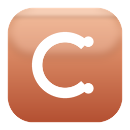

# ClaudeUsage



**Easy install with guide.** A macOS menu bar app that shows real-time [claude.ai](https://claude.ai) usage — the rolling 5-hour session window, the 7-day weekly window, and the Opus weekly window (if your plan has one).

- Color-coded percentage right in the menu bar (blue under 70%, orange 70–90%, red above 90%)
- Notifications at 80% and 95% per window (with hysteresis so they don't spam)
- Optional Launch at Login
- `sessionKey` stored in the macOS Keychain — never on disk
- Polls every 60s, click the refresh button to force-update
- **Built-in first-run welcome tour** that walks you through grabbing your Org UUID and sessionKey from DevTools

The app talks to the same internal endpoint that `claude.ai/settings/usage` calls. **It's not a public Anthropic API** — it can change at any time without notice.

---

## Download & run (no Xcode needed)

1. Grab the latest `ClaudeUsage.zip` from [Releases](https://github.com/Aiduckman/ClaudeUsage_latest_may2026/releases/latest).
2. Unzip → drag `ClaudeUsage.app` into `/Applications`.
3. **Important** — because the app isn't signed with a paid Apple Developer ID, macOS will refuse to open it on first run. Two options:
   - **Easiest**: in Terminal, run `xattr -dr com.apple.quarantine /Applications/ClaudeUsage.app` then open it normally.
   - **Or**: right-click the app → **Open** → click **Open** in the dialog (this is a one-time permission).
4. On first launch, a **Welcome to ClaudeUsage** window appears with a 3-step tour showing you exactly where to find your Organization UUID and sessionKey in your browser's DevTools.
5. After the tour, click the brain icon in your menu bar → **Settings…** → paste both values → Save. (Lost the tour? It's also under Settings → Help → "Show welcome tour".)

That's it. Numbers should populate within 60s. Click the refresh icon in the dropdown to force.

---

## How to find your Organization UUID & sessionKey

If you want the gist without the tour:

Sign into <https://claude.ai>. Open DevTools (`⌥⌘I`).

**Organization UUID** — visible to your account, stable, not secret:
1. **Network** tab → filter Fetch/XHR.
2. Click **Settings → Usage** in claude.ai.
3. Find a request to `https://claude.ai/api/organizations/<UUID>/usage`.
4. Copy `<UUID>`.

**sessionKey** — treat like a password:
1. **Application** tab → **Storage → Cookies → https://claude.ai**.
2. Copy the **Value** of the `sessionKey` row (a long string starting with `sk-ant-sid01-...`).
3. The sessionKey eventually expires — if the app says "Not signed in", grab a fresh one and paste again.

---

## Build from source

Requirements: macOS 14 (Sonoma) or later, full [Xcode](https://apps.apple.com/app/xcode/id497799835), [Homebrew](https://brew.sh), and [XcodeGen](https://github.com/yonaskolb/XcodeGen) (`brew install xcodegen`).

```bash
git clone https://github.com/Aiduckman/ClaudeUsage_latest_may2026.git
cd ClaudeUsage_latest_may2026
chmod +x build.sh
./build.sh
mv ClaudeUsage.app /Applications/
open /Applications/ClaudeUsage.app
```

Then configure via Settings exactly like the download path above.

---

## Customize

- **Bundle ID**: change `PRODUCT_BUNDLE_IDENTIFIER` in `project.yml` *and* the matching `service` in `SessionStore.swift`. Defaults are `com.example.claudeusage`.
- **Polling interval**: edit `pollingInterval` in `UsageViewModel.swift` (default: 60s).
- **Notification thresholds**: edit `thresholds: [Int]` in `UsageViewModel.swift` (default: `[80, 95]`).
- **Icon**: edit `make_icon.py` (Python + Pillow) and rebuild the icon:
  ```bash
  python3 make_icon.py icon_1024.png
  mkdir -p AppIcon.iconset
  for size in 16 32 64 128 256 512; do
    sips -z $size $size icon_1024.png --out AppIcon.iconset/icon_${size}x${size}.png
    sips -z $((size*2)) $((size*2)) icon_1024.png --out AppIcon.iconset/icon_${size}x${size}@2x.png
  done
  cp icon_1024.png AppIcon.iconset/icon_512x512@2x.png
  iconutil -c icns AppIcon.iconset
  ```

## Project layout

```
ClaudeUsage/
├── project.yml                # XcodeGen project definition
├── build.sh                   # one-shot build script
├── make_icon.py               # icon generator (Python + Pillow)
├── AppIcon.icns               # bundled app icon
├── ClaudeUsageApp.swift       # @main entry
├── AppDelegate.swift          # first-launch onboarding trigger
├── OnboardingView.swift       # 3-step welcome tour with native illustrations
├── MenuBarLabelView.swift     # the percentage shown in the menu bar
├── MenuBarContentView.swift   # dropdown content
├── SettingsView.swift         # ⌘, settings window (org UUID, sessionKey, etc.)
├── UsageViewModel.swift       # polling, state, threshold notifications
├── UsageClient.swift          # claude.ai HTTP client + JSON decoder
├── UsageData.swift            # data models
├── SessionStore.swift         # Keychain wrapper for sessionKey
├── NotificationManager.swift  # banner notifications
└── LaunchAtLogin.swift        # SMAppService toggle
```

## Troubleshooting

- **"Organization UUID not set"** — open Settings and paste it (or replay the welcome tour from Settings → Help).
- **"Not signed in"** — paste your sessionKey in Settings (it may have expired).
- **Keychain prompts on every launch** — the app is ad-hoc signed, so its identity changes on every rebuild. Click **Always Allow** each time.
- **"App is damaged and can't be opened"** — quarantine flag from the download. Run `xattr -dr com.apple.quarantine /Applications/ClaudeUsage.app`.
- **App icon doesn't show in Finder** — try `killall Finder Dock` to clear the icon cache.
- **HTTP 200 but blank** — claude.ai changed the response shape. Run `print(String(data: data, encoding: .utf8) ?? "")` in `UsageClient.fetchUsage` to see the real payload and update `RawUsageResponse`.

## License

MIT — see [LICENSE](LICENSE).
